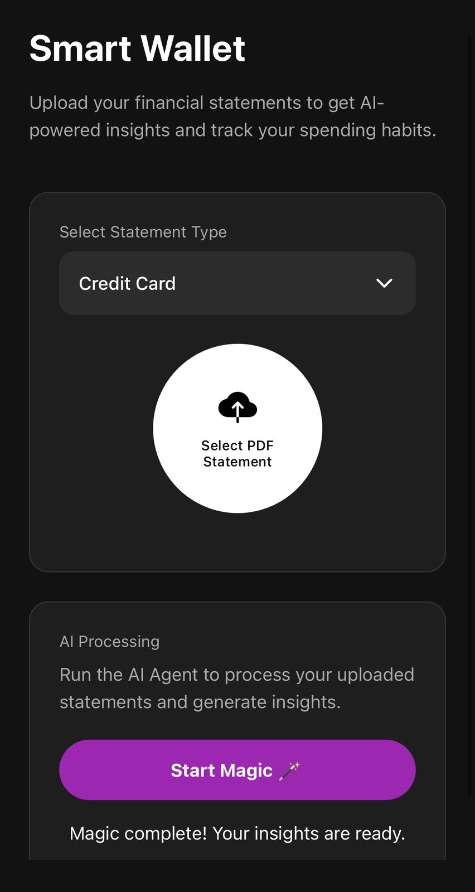
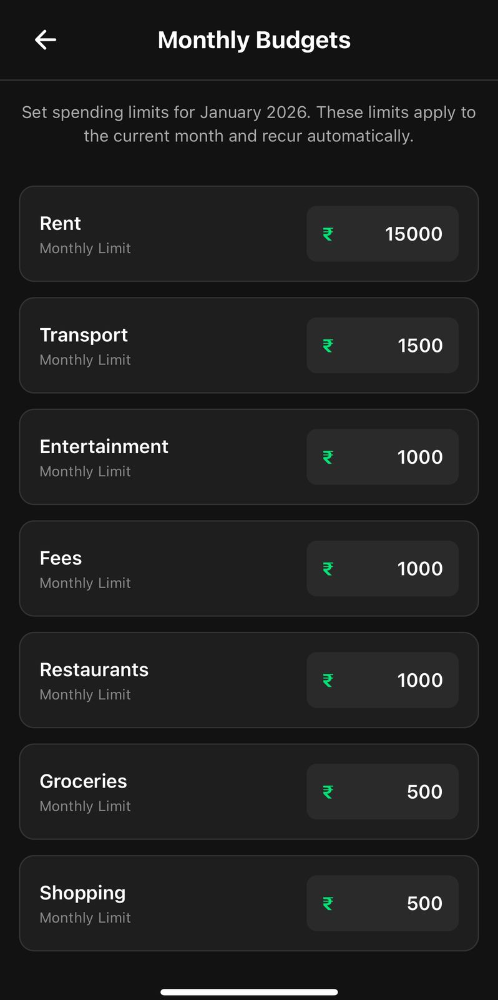
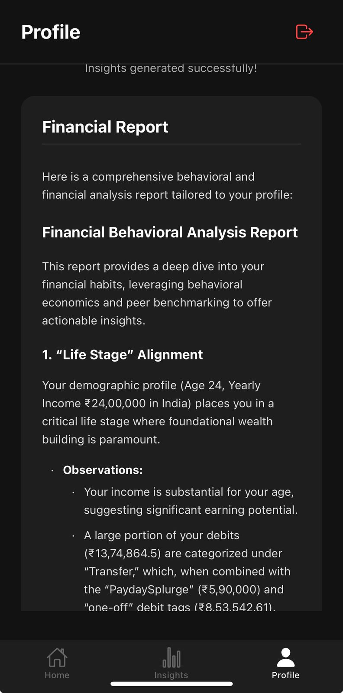
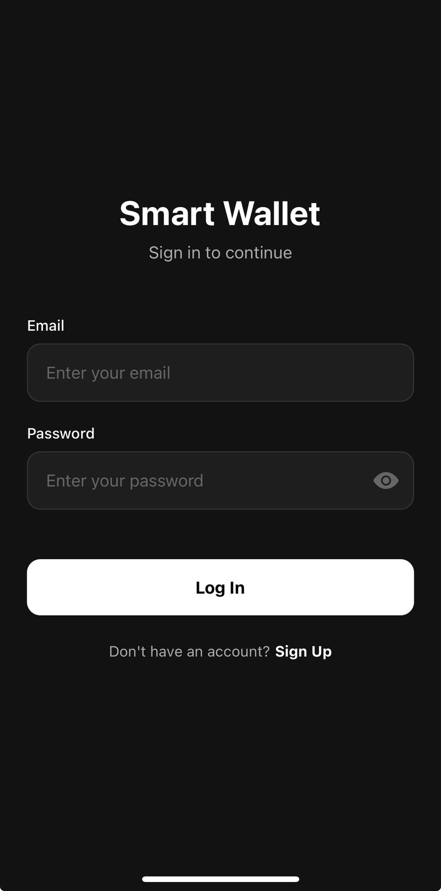
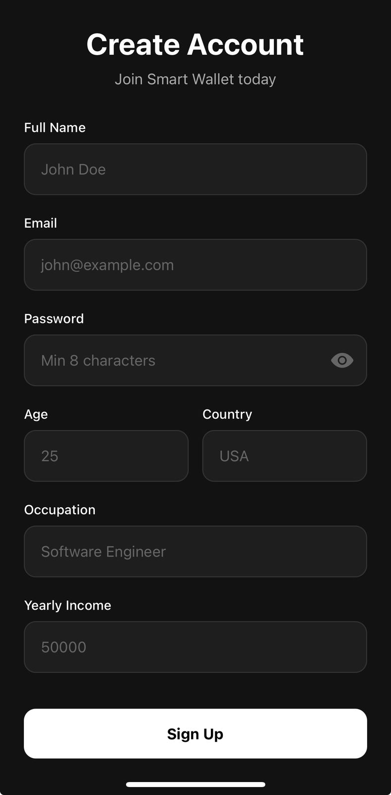
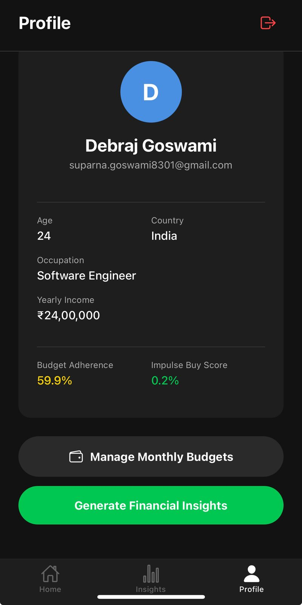
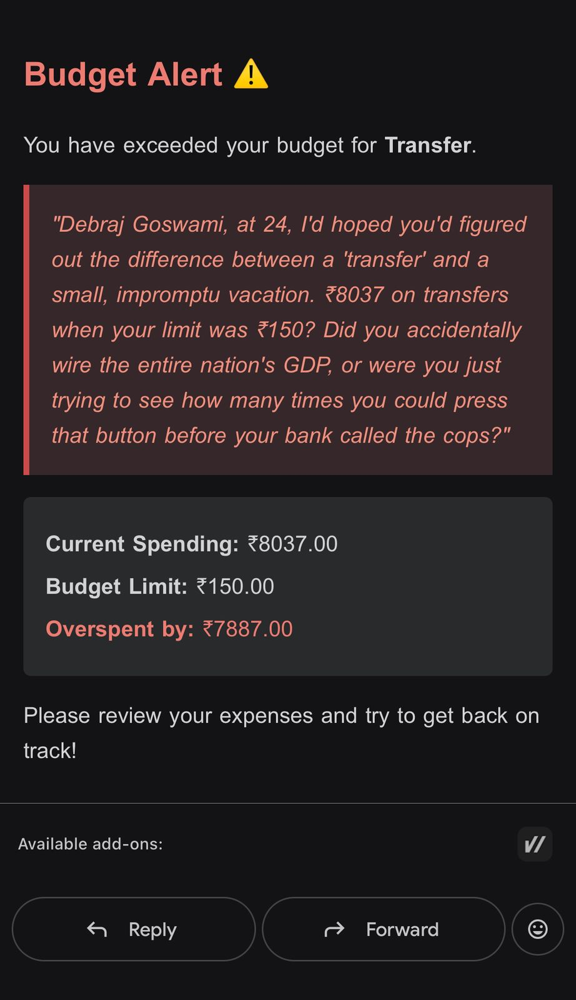

# Smart Wallet AI 🧠💸

> **"Your Personal Financial Behavioral Analyst"**

Smart Wallet AI is a next-generation expense tracking application that goes beyond simple number crunching. It utilizes **Generative AI (Gemini 2.5 Flash Lite)** to parse complex bank statements, categorize transactions with psychological behavioral tags, and provide deep, actionable insights into your spending habits.

---

## 📸 Screenshots

### Mobile App Interface
| Home Dashboard | Budget Monitoring | AI Insights |
|:---:|:---:|:---:|
|  |  |  |
| *Overview of spending & recent transactions* | *Real-time tracking vs limits* | *Psychological analysis of spending* |

### Onboarding & Profile
| Sign In | Sign Up | Profile |
|:---:|:---:|:---:|
|  |  |  |

### AI Roast Emails
> "When you break your budget, we don't just notify you—we roast you."

| Budget Alert Email |
|:---:|
|  |
| *AI-generated tough love for overspending* |

---

## 🚀 Key Features

### 1. 📄 Universal Statement Parsing
Stop entering transactions manually. Smart Wallet AI supports direct PDF uploads from major Indian financial apps and banks:
*   **Google Pay (GPay)**
*   **PhonePe**
*   **SBI Card**
*   **Axis Bank**
*   *Generic parser for other standard formats*

### 2. 🏷️ AI-Powered Behavioral Tagging
We don't just tell you that you spent ₹500 on "Food". We analyze the context to tell you **why**.
*   **Categorization:** Groceries, Utilities, Rent, Entertainment, etc.
*   **Behavioral Tags:**
    *   `DopamineHit`: Small, frequent luxury purchases (e.g., Starbucks).
    *   `RetailTherapy`: Large shopping spikes after inactivity.
    *   `VampireSpend`: Tiny recurring subscriptions you forgot about.
    *   `WeekendWarrior`: Excessive spending on Fri/Sat.
    *   `SurvivalMode`: Essential-only spending at month-end.

### 3. 📉 Deep Financial Insights
Our **LangGraph-based AI Agent** acts as a financial therapist, analyzing your monthly data to provide:
*   **Life Stage Alignment:** Are you saving enough for your age/income profile?
*   **Emotional Triggers:** Correlating mood/time with spending spikes.
*   **Burn Rate & Runway:** How long you could survive without income.
*   **50/30/20 Audit:** Automated compliance check against financial rules.

### 4. 🔥 Budget Roasts
Set category limits (e.g., "Dining Out: ₹5,000"). If you exceed them, the system triggers an email with a **custom AI-generated roast** tailored to your age and spending habits.
*   *Example:* "You've spent ₹8,000 on dining? At 25, you should be eating ramen, not financing a Michelin star chef's retirement."

---

## 🏗️ Technical Architecture

### Backend Stack
*   **Framework:** FastAPI (Python)
*   **Database:** Supabase (PostgreSQL)
*   **AI Engine:** Google Gemini 2.5 Flash Lite (via `google-genai` SDK)
*   **Agent Orchestration:** LangGraph
*   **PDF Processing:** `pdfplumber` with regex heuristics
*   **Task Queue:** FastAPI BackgroundTasks (Async processing)
*   **Rate Limiting:** Custom Redis-backed limiter (optional)

### Mobile App Stack
*   **Framework:** React Native (Expo)
*   **Navigation:** React Navigation (Tab & Stack)
*   **Networking:** Axios
*   **UI Components:** Native components with custom styling

---

## 🧩 Implementation Details

### Modular Backend Structure
The codebase has been refactored for scalability:
```text
backend/
├── api/                # API Routes (Auth, Upload, AI, Transactions)
├── services/           # Business Logic
│   ├── ai_service.py   # LangGraph StateGraph & Gemini Integration
│   ├── pdf_processor.py# Extraction logic for GPay, PhonePe, etc.
│   ├── ai_roast.py     # Roast generation logic
│   └── budget_monitor.py # Budget checking & Email alerts
├── core/               # Config & Dependencies
└── utils/              # Shared Helpers (Date/Amount normalization)
```

### The AI Agent Workflow (`ai_service.py`)
We use a **StateGraph** to orchestrate the AI pipeline:
1.  **Fetch Unverified:** Batches unverified transactions from Supabase.
2.  **Tag with Gemini:** Sends transaction details + few-shot examples to Gemini.
3.  **Router:** Decides if confidence is high enough (`>0.85`) to auto-verify.
4.  **Insight Generation:** Aggregates verified data to generate a markdown report.

### PDF Parsing Strategy (`pdf_processor.py`)
A hybrid approach:
*   **Heuristic Detection:** Identifies statement provider (GPay, SBI, etc.) via keywords.
*   **Regex Extraction:** tailored patterns for each provider to extract `Date`, `Description`, `Amount`, `Type`.
*   **Fallback:** Generic table extraction for unknown formats.

---

## 🛠️ Installation & Setup

### Prerequisites
*   Python 3.9+
*   Node.js & npm
*   Supabase Account
*   Google Gemini API Key

### 1. Backend Setup
```bash
cd backend
python3 -m venv venv
source venv/bin/activate
pip install -r requirements.txt

# Create .env file
echo "SUPABASE_URL=your_url" >> .env
echo "SUPABASE_KEY=your_key" >> .env
echo "GEMINI_API_KEY=your_key" >> .env

# Run Server
uvicorn main:app --reload
```

### 2. Mobile App Setup
```bash
cd mobile-app
npm install

# Run on Simulator/Device
npx expo start
```

---

## 🔮 Future Roadmap
*   [ ] **WhatsApp Integration:** Send statement PDFs directly via WhatsApp.
*   [ ] **Goal Tracking:** "Save for Vacation" buckets.
*   [ ] **Subscription Manager:** One-click cancel for `VampireSpend`.
*   [ ] **Investment Suggestions:** AI-driven stock/MF recommendations based on savings.

---

**Developed with ❤️ by [Your Name/Team]**
